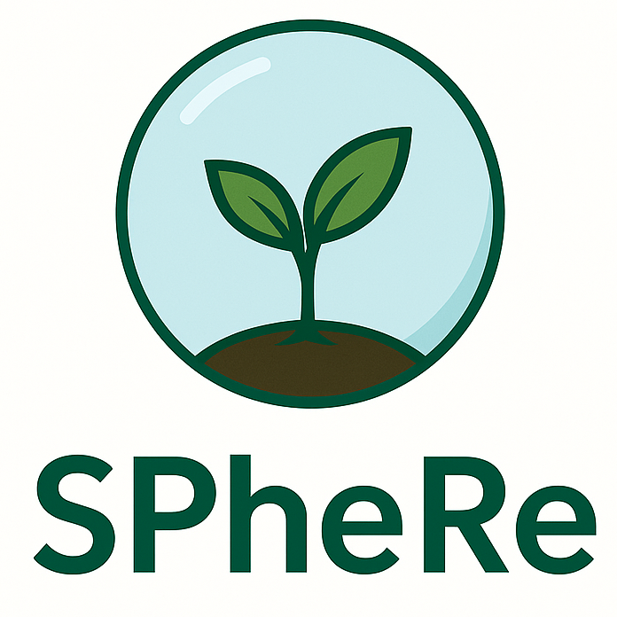

# SPheRe - Smart Phenotyping Research, presents A Remote Monitoring of Water Stress in Plants via RGB Imaging

This automatic irrigation system uses lower-cost components and data storage in the cloud. Employing a CMOS camera module installed at a fixed position instead of a colorimeter.
At the core of this RGB imaging system is the electronic board Seeed Studio XIAO ESP32S3 Sense, a tiny development board with an integrated 5.0-megapixel camera (OV5640, OmniVision Technologies Inc.,Sunnyvale, CA, USA) that captures images of the plant under analysis. The SoC (ESP32-S3R8, Espressif Systems,Zhangjiang, SH, CN) on the motherboard features a dual-core MCU, Wi-Fi 2.4G, and BLE 5.0 combo, enabling wireless transmission of the measurements and captured images to the cloud.

About the remote image processing, it is possible 

Built by Flávio Souza.

